# License to Quiz Interactive Website


[Click here to view the live Project Page](https://jts272.github.io/pp2-license-to-quiz/index.html) (Right/Middle click to open in a new tab)

---

Need I remind you, 007, that you have a license to quiz?

This documentation covers an interactive front-end web application in quiz format, based on the world of James Bond 007. As this historic, storied franchise celebrates its 60th year, this app serves as way for fans to test their knowledge in an engaging way.

The technologies used to power this quiz consist of HTML5, CSS3 and pure JavaScript. These technologies will be used in conjunction to create a responsive site wherein users can engage with elements in a fun, intuitive way.

---

## User Experience

(what the user experience is intended to be. include different perspectives, user stories)

This application is designed for fans of the James Bond 007 franchise. It tests the user's knowledge to varying degrees of difficulty.

The site is fast, responsive and intuitive. The flow of the site is evident on the homepage, with call-to-action buttons for the user to navigate. Game rules are shown via a modal to inform the player how to proceed with game flow.

Accessibility through contrast and appropriate HTML feature usage affords a consistent site experience to users.

This application has been built as a natural extension from the 007 franchise's online presence. [007.com](https://www.007.com/) was referenced as a starting point for the user's expectations. As we will explore, the app's presentation is in keeping with these established, expected traditions.

### User Stories

Here we examine the intention of the site. Client perspective refers to the license holders of the intellectual property.

- Client Goals:
  - To provide entertainment for franchise fans
  - To project a visual impression in-keeping with fan expectations
  - For users to engage with the IP

- First Time Visitor Goals:
  - To find site navigation evident
  - To have a great first impression of site presentation
  - To play their first quiz game

- Returning Visitor Goals:
  - To play the quiz game at a harder level
  - To view target scores, which they would aim to beat

## Design Process

The strategy of this app is to entertain fans of 007. As a quiz format, questions were created to target 3 different levels of knowledge. They are made from trivia throughout different stages of history of the Bond filmography.

Fans know Bond as a smooth, suave spy and this was to be reflected throughout the site's practical elements. These details will be explored in their relevant sections below.

Project scope determined what features were in and out. In this project, it was key to focus on the [minimal viable product](https://en.wikipedia.org/wiki/Minimum_viable_product) (MVP). At its core, this quiz app must contain:
 - Rules of play
 - A selection of difficulties, with unique question sets
 - A scoreboard to encourage user performance
 - Feedback to the user for all actions
 - Intuitive navigation system to tie the experience together

This project in particular relied on a programming language to handle site interactivity. I bore in mind the minimum required features that must be implemented as my understanding of JavaScript grew with the project.

For site structure, brief instruction is given to the user, followed by interactive buttons to perform their labelled action. The header and body are responsively styled with a mobile-first approach. This ensures that regardless of device, relevant content is readily accessible and the user is never stuck.

At the skeleton level, the site content is displayed on 'cards' that hold the text content and interactive elements of the site. This sits on a grey background. At the desktop level, this background transforms to a minimalist black and white shot of various Bonds throughout the years, which vary by page. This reinforces the suave image of the franchise, whilst reminding users of its legacy.

On the surface plane of design, the practical elements combine to project an image and tone that fans have come to expect. As well as films, there are many popular video games for this IP which have a well-established tone for the franchise in terms of interactive entertainment.

User instruction is delivered in a manner that the user (or 'Agent'!) might expect from the character of 'Q' in a briefing session. Messaging is concise, yet functional and addresses the user as if they were in-character as a secret agent embarking on a mission.

## Practical Elements

### Typography

[007.com](https://www.007.com/) was used as a springboard for the visual appearance of this app. Upon inspection, I found that heading elements used 'Futura' font and body text used 'Georgia'. The latter was a common web-safe font. I was unable to find Futura on Google Fonts, however [this blog post](https://www.naomi-maria.com/5-free-alternatives-for-futura-on-google-fonts/) let to me importing the 'Jost' font for an almost identical match.

### Colour

Much like the official website, I opted for a minimalist, understated use of colour. The expected black and white of the iconic tuxedo was highlighted with gold - another colour famously associated with Bond. A neutral grey was used as the body background. The hex value for gold was used directly on the website. The grey shade came from the colour picker in MS Paint for the Daniel Craig background image.

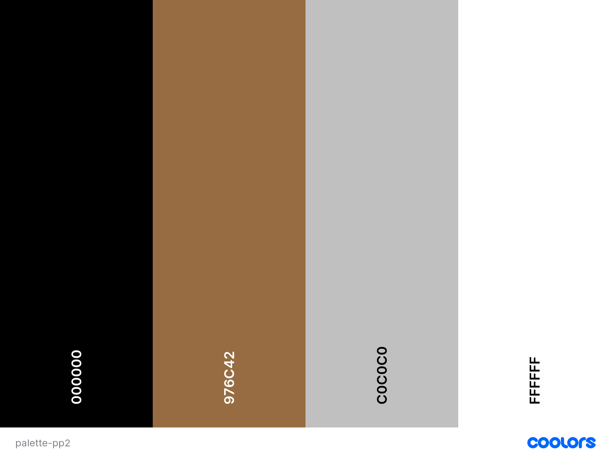

### Imagery

The Bond franchise has iconic visual motifs. I included the 'gun barrel' and '007' icons, which were available from sites such as [PNGEgg](https://www.pngegg.com/) or [PNGWing](https://www.pngwing.com/)

The 007 logo was used in the title, and the gun barrel served as the favicon.

<details>
<summary>007 Logo</summary>

</details>

<details>
<summary>Gun Barrel</summary>

</details>

### Wireframes

My process for page layout design is to firstly sketch on paper the layout and content. From there, I recreate these drafts in [Balasmiq.](https://balsamiq.com/)

These designs serve as a guide for the general appearance of the page. By using a mobile-first design strategy, these layouts were naturally scaleable to desktop view. The Bond background images were added to the desktop UX to help set the mood and add visual interest.

Due to the iterative nature of this project, some elements on the wireframe plans my not be represented in the deployed product.

<details>
<summary>Home Page</summary>
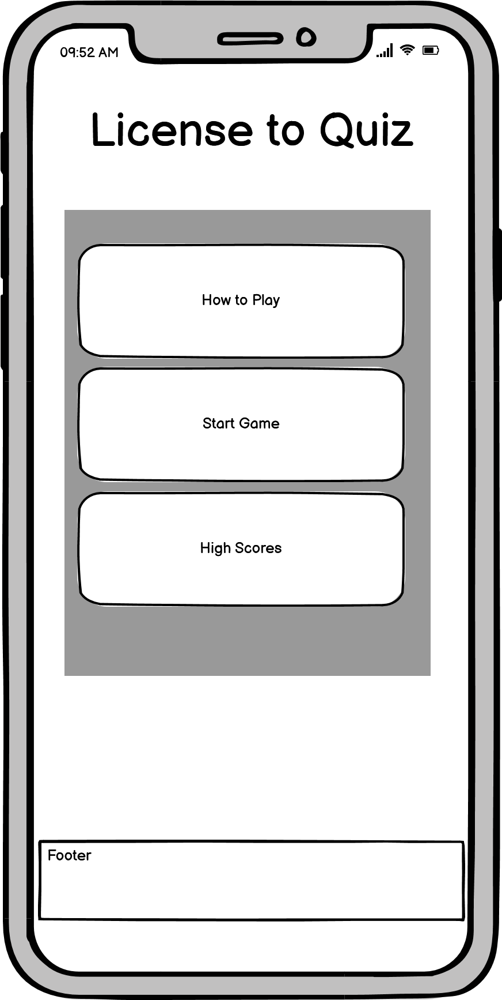
</details>

<details>
<summary>Difficulty Select</summary>
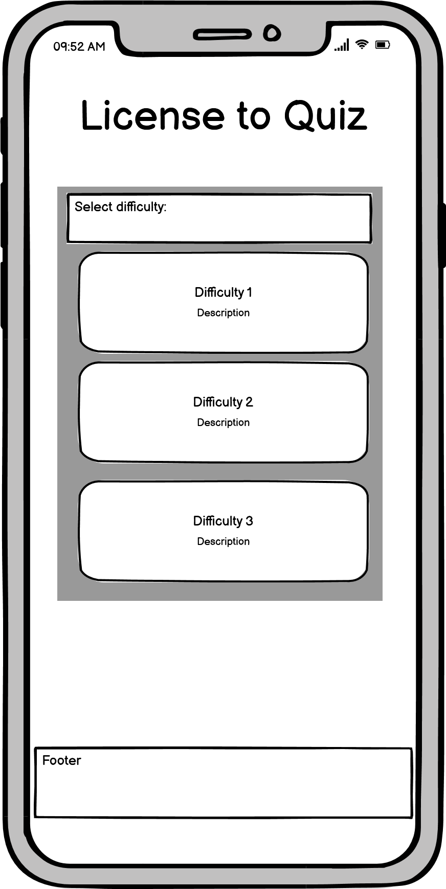
</details>

<details>
<summary>High Scores Page</summary>
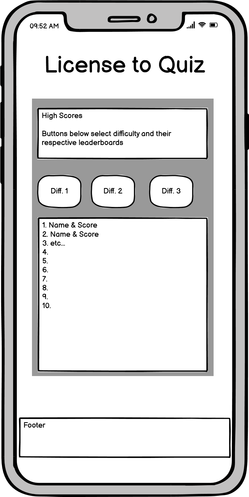
</details>

<details>
<summary>Game in-progress</summary>
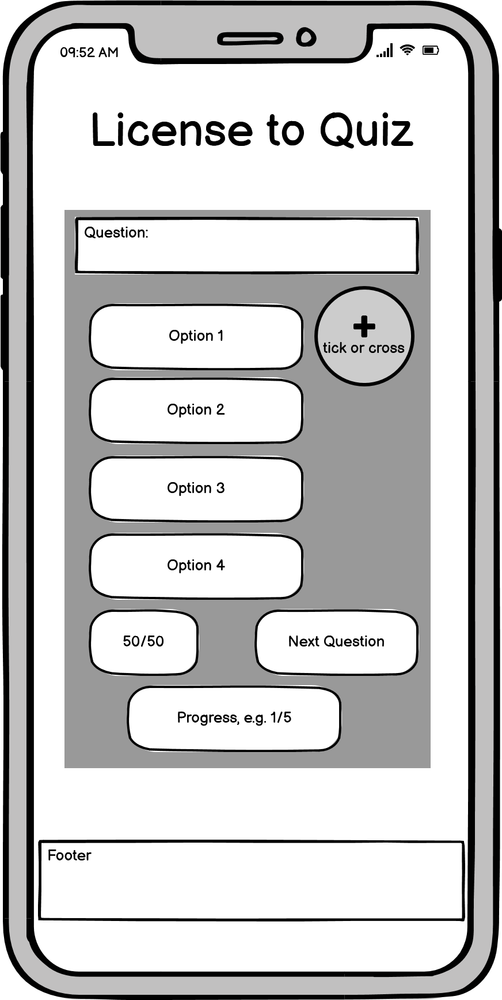
</details>

<details>
<summary>Game end</summary>
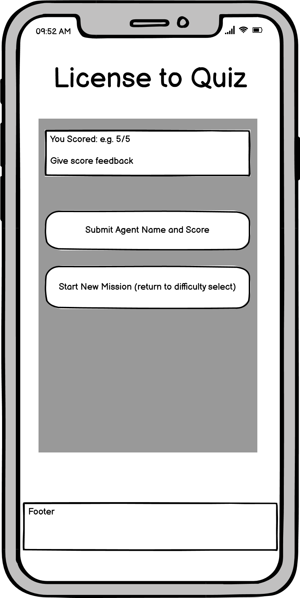
</details>

<details>
<summary>Game screen (detailed)</summary>
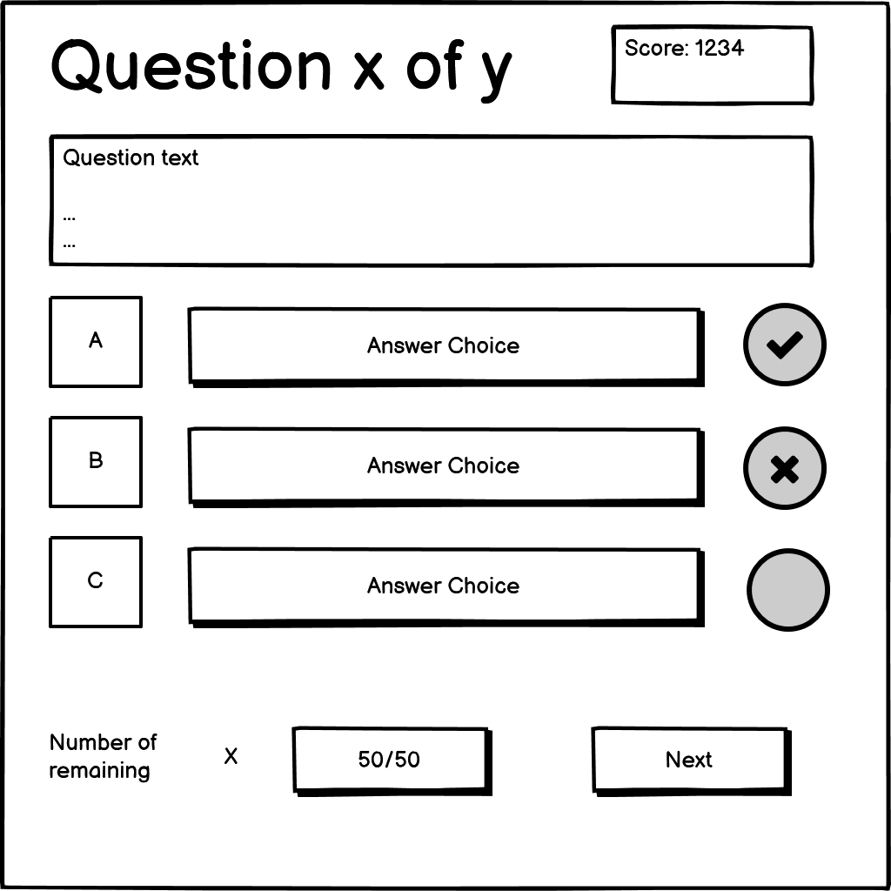
</details>

### Quiz Questions

As a source of Bond trivia questions and answers, I used [this post with 80+ questions for fans,](https://thoughtcatalog.com/january-nelson/2021/10/james-bond-trivia/) as well as [this Bond guide](https://www.goodreads.com/book/show/1836708.Essential_Bond_The) from my personal collection.

I selected questions which I found relevant to their difficulty and added in dummy choices for the quiz selections.

## Features

We will look at the features in detail. Screenshots are provided from the desktop experience to illustrate each part.

### Home Page

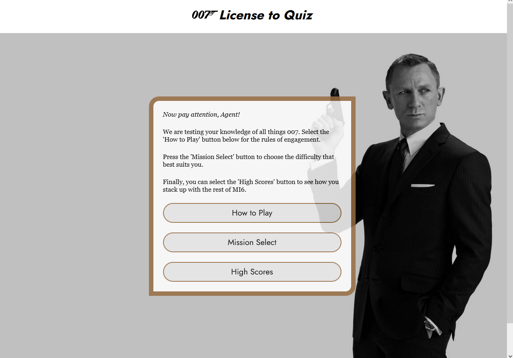

The user lands here. Instantly, they get a sense of what the app is about through the use of colour and imagery. Concise and separated body text informs the of the app's function. Large buttons are labelled and invite site nagivation. The large white header banner holds the iconic logo and stylized text which show the site's intent. It also functions as a link to the homepage, as expected.

A hover state was included for desktop users to provide navigational feedback when they mouse over buttons.

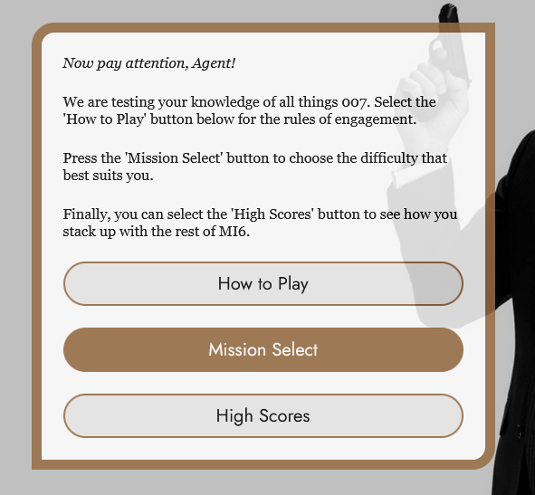

### Footer

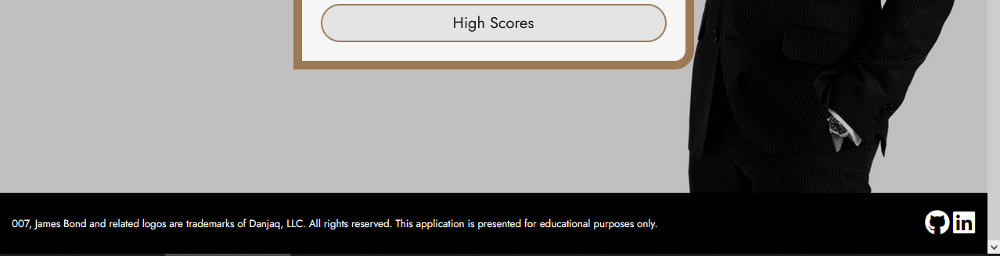

The footer in black contrasts nicely with the header. It's content is succinct; containing copyright information and links to the developer's socials. Both the header and footer are consistent across pages.

### How to Play Modal

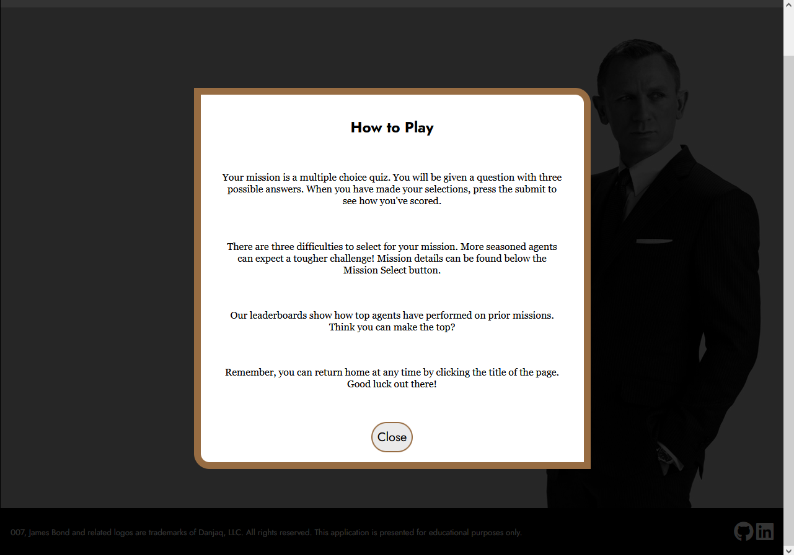

This is expected to be the user's first action. It outlines the game flow and how to navigate the site. It uses the modern html `<dialog>` feature in conjunction with JavaScript. This is great for keyboard and screen reader users out-of-the box and can be easily closed with the `Esc` key. [Compatibility was checked](https://caniuse.com/?search=dialog) before implementation.

### Game Select Page

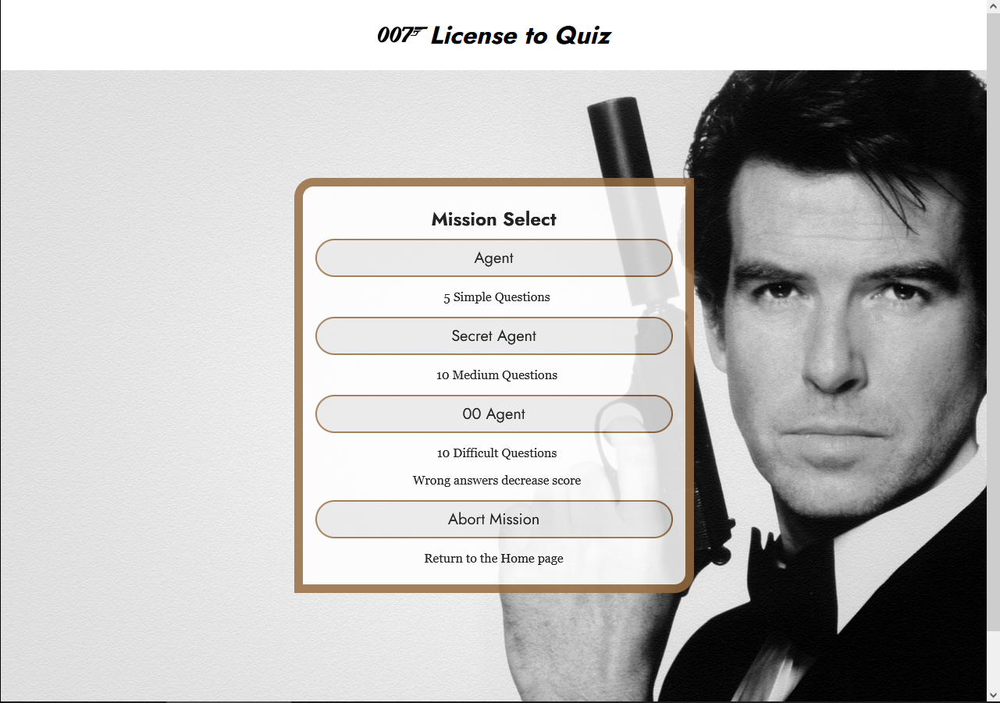

Here, the user choses their quiz difficulty. An exact description of the difficulty details is provided below the selection. This screen will look familiar to fans of the popular N64 title [GoldenEye 007.](https://en.wikipedia.org/wiki/GoldenEye_007_(1997_video_game))

### Game in Progress

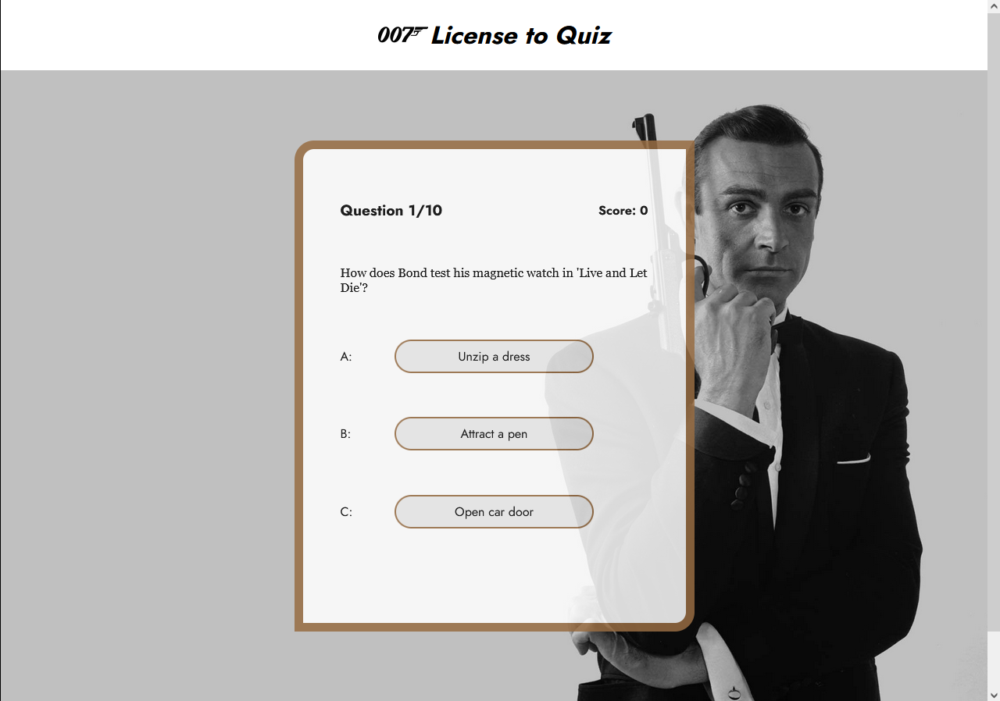

This is where the user does the majority of their interaction. This was styled with CSS grid to provide a consistent layout. It consists of:

- Question counter: Dynamically updates the progress of the quiz
- Score: Dynamically updates as questions are answered
- Current Question: The player must answer this
- Answer Selections: The player choses their answer
- Feedback: Responds to correct or incorrect answers:

<details>
<summary>Correct</summary>
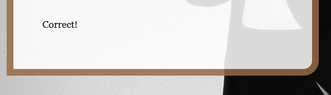
</details>

<details>
<summary>Incorrect</summary>
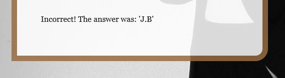
</details>

### Game End

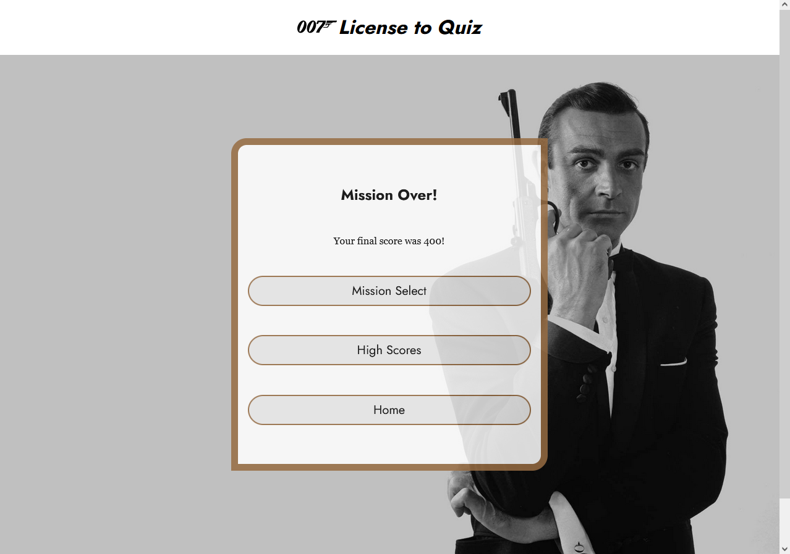

The user is informed of their final score and offered navigational buttons to the relevant sections.

### Scores Page

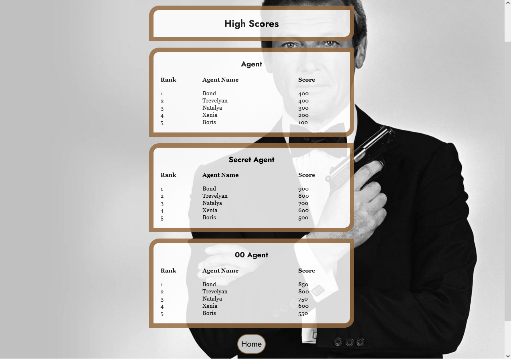

Scores of 'past agents' are shown here. This is provided as a reference for the user, giving them targets to beat.

### 404 Page

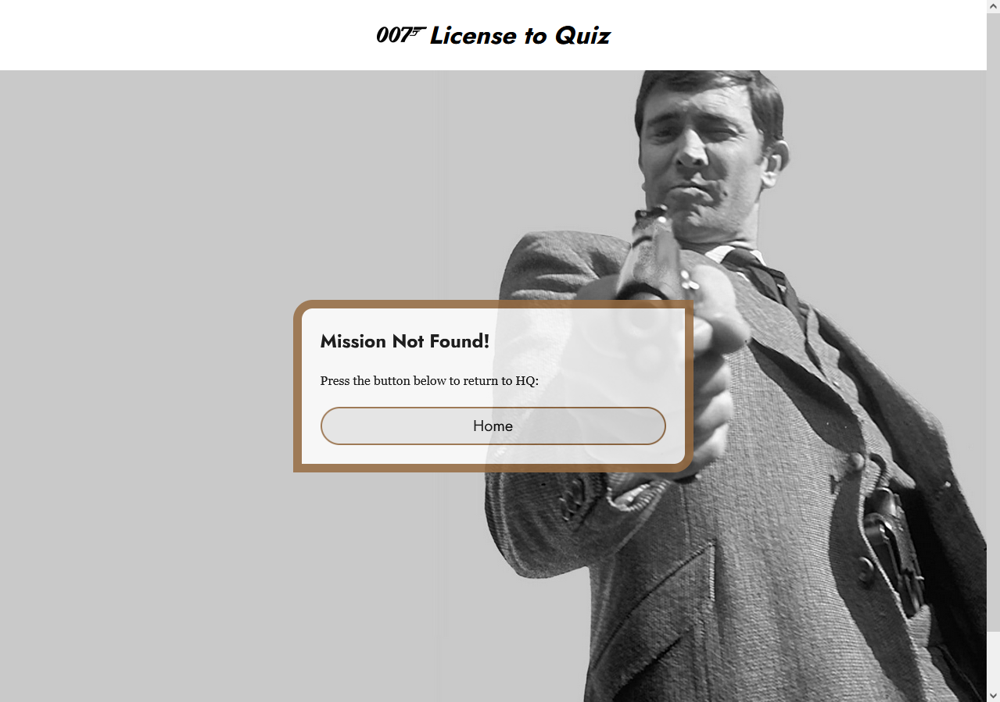

In the event of error, the user is given safe passage back to 'HQ' (or the homepage!).

### Favicon


[favicon.io](https://favicon.io/) was used to convert the gun barrel logo to favicon format. This signifies the current tab to the user. Black on white was used instead of transparency to ensure visibility for dark-themed users.

## Development & Testing

This app was developed as my first foray into programming languages; namley with JavaScript. Multiple guides were consulted to make this app possible. Here are three that I used at certain points:

[Guide 1](https://www.youtube.com/playlist?list=PLDlWc9AfQBfZIkdVaOQXi1tizJeNJipEx) - Very slick and in keeping with the project needs. However, as I progressed, I found the code and syntax hard to follow. I did not feel this was helping me to progress my thinking.

[Guide 2](https://simplestepscode.com/javascript-quiz-tutorial/) - I had the idea to make a quiz with radio buttons, thinking it would be easier to verify input. I used this guide for a time, but ultimately found it to be inflexible and it did not meet the MVP standard of the project.

[Guide 3](https://academy.zenva.com/product/javascript-mini-projects-language-learning-game/) - This was the basis of the project. I took the time to improve my understanding and usage of the programming language. Code from the other guides was backed up locally and is not present in the deployed project.

Building on this skills learned in my [previous and first project,](https://github.com/jts272/pp1-happy-bees-cafe) I was confident to leverage and build upon my HTML and CSS skills. This was a solid foundation for me to create a slick, responsive front-end as the scripting was being implemented.

Testing was a key part of the process. A detailed breakdown of testing follows below:

### User Stories Testing

Let's examine how these goals have been acheived:

- Client Goals:
  - To provide entertainment for franchise fans
    - Fully fucntional quiz app based on historical franchise lore
  - To project a visual impression in-keeping with fan expectations
    - Design cues take from official online presence
  - For users to engage with the IP
    - Users can engage with the lore to improve their score. If questions are unfamilliar, they might want to watch the corresponding movie

- First Time Visitor Goals:
  - To find site navigation evident
    - Navigation options shown prominently and immediately
  - To have a great first impression of site presentation
    - Slick use of colour and key art set the tone
  - To play their first quiz game
    - Play rules are readily provided, along with a choice of difficulties

- Returning Visitor Goals:
  - To play the quiz game at a harder level
    - Harder difficulties are provided for invested fans
  - To view target scores, which they would aim to beat
    - Links to the score board are prominent, to motivate the user for a better score

### Functionality Testing

- All pages:
  - Internal links go to relevant page: :heavy_check_mark:
  - External links open in external tabs: :heavy_check_mark:
  - Mouse hover states function as intended: :heavy_check_mark:
  - Transparencies are displayed correctly on desktop: :heavy_check_mark:

- Modal:
  - Displays correctly and can be closed with `Esc` key: :heavy_check_mark:

- Difficulty Select:
  - Each link starts its corresponding game: :heavy_check_mark:

- In-Game:
  - User's input is validated with feedback: :heavy_check_mark:
  - Next question loads after user input: :heavy_check_mark:
  - Question counter increments properly: :heavy_check_mark:
  - Score counter increments/decrements properly: :heavy_check_mark:

- Game-End:
  - Correct final score is shown: :heavy_check_mark:
  - Navigational links function correctly: :heavy_check_mark:

### Validation Testing

Validation of code was tested throughout development and after deployment. Instructions are provided on how to self-test each factor below:

#### HTML (W3C)

No warnings found!

[Insert page URL into the 'Address:' field](https://validator.w3.org/#validate_by_uri+with_options)

#### CSS (W3C)

No warnings found!

[Insert page URL into the 'Address:' field](https://jigsaw.w3.org/css-validator/#validate_by_uri)

#### JavaScript (JSHint)

No warnings found!

Insert these two lines of code at the top of [JSHint Validator](https://jshint.com/):

```
/* jshint esversion:6 */
/* jshint multistr:true */
```

Then paste in the source code of the `.js` files, one at a time, from the project's `assets` folder.

#### Accessibility (WAVE)

No Errors found!

[Insert page URL into the 'Web page address:' field](https://wave.webaim.org/)

Alternatively, I like to instantly check with browser extensions:

- [Chrome Extension](https://chrome.google.com/webstore/detail/wave-evaluation-tool/jbbplnpkjmmeebjpijfedlgcdilocofh)
- [Firefox Add-on](https://addons.mozilla.org/en-GB/firefox/addon/wave-accessibility-tool/)


#### Mobile-Friendly

[Google Mobile-Friendly Test](https://search.google.com/test/mobile-friendly)

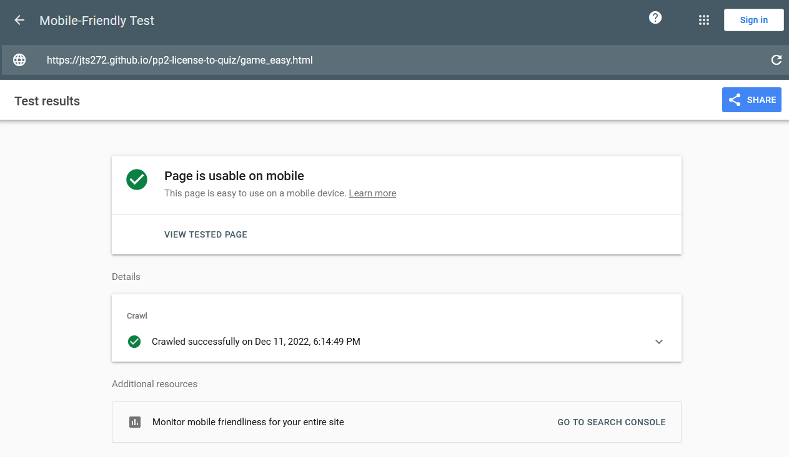

#### Lighthouse Reports

Recommended testing environment:

Google Chrome (Incognito window)
- Open DevTools (F12)
- Select 'Lighthouse' from top tab that contains 'Elements', 'Console' etc.
- Select the 'Mobile' Device radio button
- Click 'Analyze page load'

<details>
<summary>Home Page</summary>
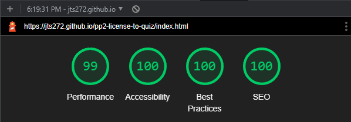
</details>

<details>
<summary>Difficulty Select</summary>
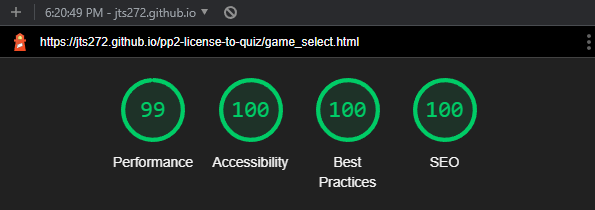
</details>

<details>
<summary>In-Game</summary>
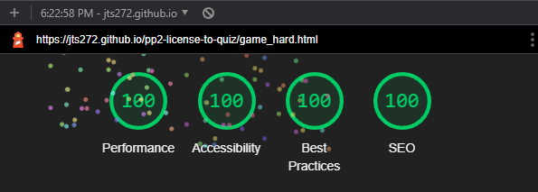
</details>

<details>
<summary>Scores Page</summary>
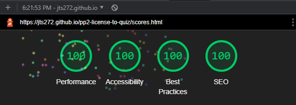
</details>

## Version Control & Code Maintainability

Commits were made to GitHub frequently throughout development. I built upon my commit habits by following the [Conventional Commits](https://www.conventionalcommits.org/en/v1.0.0/#summary) and [Angular](https://github.com/angular/angular/blob/22b96b9/CONTRIBUTINGmd#-commit-message-guidelines) guidelines.

Each commit is prefixed with a short `<type>` of commit, followed by the body. Additionally, some commits include another optional text body, to provide further insight on the nature of the commit.

[View project commit history](https://github.com/jts272/pp2-license-to-quiz/commits/main)

The project logic was heavily iterated as the project and my knowledge base grew. I have provided transparent commits for any instance where code a dropped.

I made sure to consult the [Google JavaScript Style Guide.](https://google.github.io/styleguide/jsguide.html) Key takeaways include:
- 80 column character count (line rulers can be configured in VS Code)
- whitespace, trailing commas, indentation rules etc.
- Commenting practice

Comments were also included in the HTML markup in this project to delineate the element's function. The stylesheet was organized by section. More global rules were at the top, whilst media queries were last.

Script tags to relevant JavaScript files were placed as the last child of the body tags. Each page follows a consistent flow that is human-scannable.

The overall goal is to create code that is robust, yet semantically logical to human readers too. I commented heavily on the script side. My code needs to be understandable now and also in the future. Furthermore, it eases potential future collaboration.

## Deployment, Cloning & Forking

GitHub Pages was used as the deployment platform. Here are the steps to deploy:

- Select 'Settings' at the top of the repository
- Select 'Pages' from the left tab
- Select 'main' Branch and '/root' folder then select 'Save'
- After a few minutes the site will be live and a link will be provided

How to Clone:

- Select the green 'Code' dropdown button
- Copy the HTTPS link to the clipboard
- Type `git clone` followed by the copied link in your repository terminal
- The project files will download to your working directory

How to Fork:

- Log in/Sign up to GitHub
- Select 'Fork' from the top right corner

## Bugs

(collect as you go to go here)

## Devices & Technologies Used

## Credits & Resources

## Learning Opportunities

## Closing Words