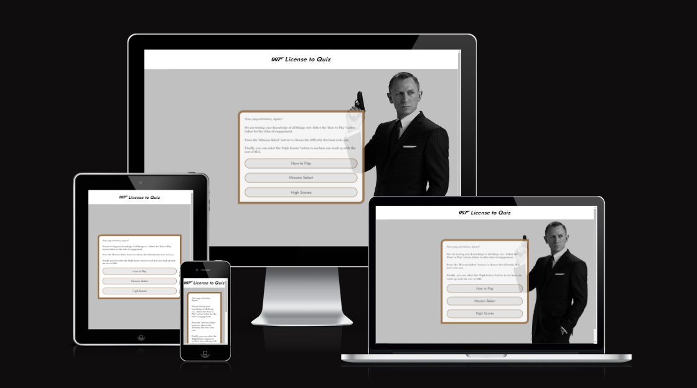

# License to Quiz Interactive Website

[Click here to view the live Project Page](https://jts272.github.io/pp2-license-to-quiz/index.html) (Right/Middle click to open in a new tab)

---

Need I remind you, 007, that you have a license to quiz?

This documentation covers an interactive front-end web application in quiz format, based on the world of James Bond 007. As this historic, storied franchise celebrates its 60th year, this app serves as way for fans to test their knowledge in an engaging way.

The technologies used to power this quiz consist of HTML5, CSS3 and pure JavaScript. These technologies will be used in conjunction to create a responsive site wherein users can engage with elements in a fun, intuitive way.

---

## User Experience

(what the user experience is intended to be. include different perspectives, user stories)

This application is designed for fans of the James Bond 007 franchise. It tests the user's knowledge to varying degrees of difficulty.

The site is fast, responsive and intuitive. The flow of the site is evident on the homepage, with call-to-action buttons for the user to navigate. Game rules are shown via a modal to inform the player how to proceed with game flow.

Accessibility through contrast and appropriate HTML feature usage affords a consistent site experience to users.

This application has been built as a natural extension from the 007 franchise's online presence. [007.com](https://www.007.com/) was referenced as a starting point for the user's expectations. As we will explore, the app's presentation is in keeping with these established, expected traditions.

### User Stories

Here we examine the intention of the site. Client perspective refers to the license holders of the intellectual property.

- Client Goals:
  - To provide entertainment for franchise fans
  - To project a visual impression in-keeping with fan expectations
  - For users to engage with the IP

- First Time Visitor Goals:
  - To find site navigation evident
  - To have a great first impression of site presentation
  - To play their first quiz game

- Returning Visitor Goals:
  - To play the quiz game at a harder level
  - To view target scores, which they would aim to beat

## Design Process

(5 planes)

### Typography

### Colour

### Wireframes

### Quiz Questions

## Features

(include what MVP has to consist of - homepage, quiz, scores. use of modals. difficulty select)

### Homepage

### Game Page

### Scores Page

### 404 Page

### Favicon

## Development & Testing

(include description of dev process and some background to testing)

### User Stories Testing

### Functionality Testing

### Validation Testing

#### HTML (W3C)

#### CSS (W3C)

#### JavaScript (JSHint)

#### Accessibility (WAVE)

#### Mobile-Friendly

### Lighthouse Reports

#### Mobile

#### Desktop

## Version Control & Code Maintainability

(about conventional commits, BEM etc.)

## Deployment, Cloning & Forking

## Bugs

(collect as you go to go here)

## Devices & Technologies Used

## Credits & Resources

## Learning Opportunities

## Closing Words